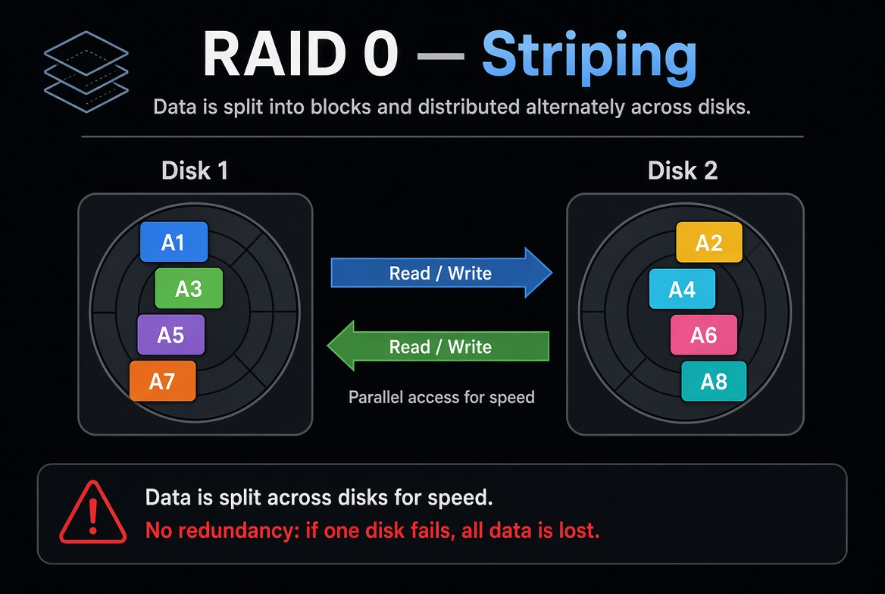

---

# RAID 0 — En profondeur

## 1. Le cadre

Le **RAID 0** s’appelle aussi **striping**.

L’idée est simple :
au lieu d’écrire toutes les données sur un seul disque, on les découpe en morceaux et on les répartit sur plusieurs disques en parallèle.

Imagine 2 disques :
- une partie des données va sur le disque A
- l’autre partie va sur le disque B

Le système lit et écrit sur les deux en même temps.

Résultat :
- plus de débit
- plus de performance
- **aucune sécurité**

---

## 2. Comment ça fonctionne concrètement

Prenons un exemple simple avec **2 disques**.

Tu veux écrire un fichier.

En fonctionnement normal (1 disque) :
- le fichier est écrit en entier sur le même disque

En RAID 0 :
- le fichier est découpé en blocs (stripes)
- bloc 1 → disque 1
- bloc 2 → disque 2
- bloc 3 → disque 1
- bloc 4 → disque 2
- etc.

Les disques travaillent **en parallèle**.

C’est pour ça que le RAID 0 est rapide :
le contrôleur (ou le logiciel) n’attend pas qu’un seul disque fasse tout le travail.

Plus tu ajoutes de disques, plus tu peux monter en performance — en théorie.

---

## 3. Ce que le RAID 0 apporte vraiment

### Performance
C’est **son seul vrai intérêt**.

- Lecture plus rapide
- Écriture plus rapide
- Débit cumulé des disques

Exemple simplifié :
- 1 disque à 200 Mo/s
- 2 disques en RAID 0 → on peut approcher 400 Mo/s
- 4 disques → encore plus

Attention : ce n’est jamais parfaitement linéaire, mais l’idée est là.

### Capacité
Bonne nouvelle de ce côté-là :
tu récupères **toute** la capacité des disques.

2 disques de 1 To en RAID 0 = **2 To utilisables**

Contrairement au RAID 1 où tu perds la moitié.

---

## 4. Le gros défaut : aucune tolérance de panne

C’est le point critique.

En RAID 0 :
- si **1 seul disque** meurt
- **toutes les données sont perdues**

Pourquoi ?
Parce que chaque fichier est éclaté sur plusieurs disques.
Il manque une partie → le fichier est cassé.
Et souvent, tout le volume devient illisible.

Donc :
- RAID 0 = performance
- RAID 0 ≠ sécurité
- RAID 0 ≠ sauvegarde

C’est même l’inverse d’une logique de résilience.

---

## 5. Dans quels cas on l’utilise

### Cas où ça a du sens
- machine de montage vidéo
- poste de travail qui a besoin de vitesse
- serveur de cache temporaire
- environnement où les données sont recréables facilement
- certains usages de lab / test

### Cas où il ne faut pas l’utiliser
- données critiques
- bases de production
- fichiers irremplaçables
- serveurs où la continuité de service est importante

En datacenter, le RAID 0 seul est **rare** sur des volumes importants et critiques.

---

## 6. RAID 0 en datacenter / serveur pro

Sur un serveur :
- le RAID peut être géré par un **contrôleur hardware**
- ou en **software** (mdadm, etc.)

Le technicien voit souvent :
- l’état du virtual disk / volume
- le type de RAID configuré
- si le volume est “Optimal”, “Degraded”, etc.

En RAID 0 :
- il n’y a pas de notion de “disque de secours utile”
- si un disque tombe, le volume tombe avec

C’est pour ça qu’on le réserve à des usages très spécifiques.

---

## 7. Ce qu’il faut retenir sur le RAID 0

| Critère | RAID 0 |
|--------|--------|
| Performance | Excellente |
| Sécurité | Nulle |
| Capacité utile | 100 % |
| Tolérance de panne | 0 disque |
| Complexité | Faible |
| Usage principal | Vitesse |

---

## 8. Phrase simple à retenir

**RAID 0 = on met les disques ensemble pour aller plus vite, mais si l’un casse, tout casse.**

---

