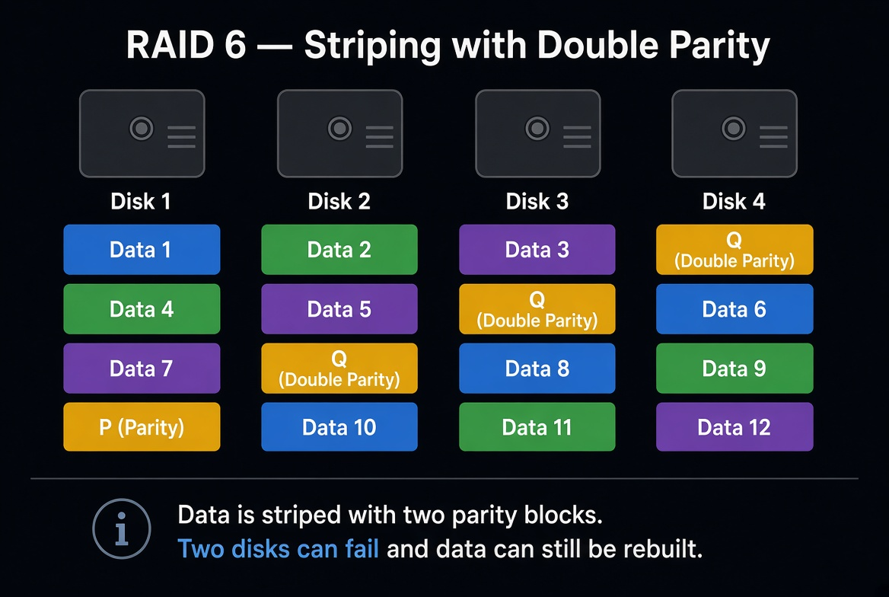

Oui, **RAID 6** existe, et il est important.

Même format, on développe.

---

# RAID 6 — En profondeur

## 1. Le cadre

Le **RAID 6** ressemble au RAID 5, avec une différence majeure :
il utilise **deux parités** au lieu d’une.

Donc :
- les données sont réparties (striping)
- **et** deux informations de parité sont calculées / stockées

Résultat :
le volume peut survivre à la perte de **2 disques** en même temps.

C’est pour ça qu’on le voit souvent dès que les volumes grossissent et que le risque de double panne devient réel.

---

## 2. Comment ça fonctionne concrètement

Minimum : **4 disques**

Comme en RAID 5, les données sont découpées sur plusieurs disques.
Mais au lieu d’avoir une seule parité, on en a deux.

Exemple simplifié :
- une partie des disques porte les blocs de données
- deux blocs de parité (P et Q) permettent de reconstruire les informations manquantes

Ces parités sont réparties sur l’ensemble des disques.

### Pourquoi deux parités ?
Parce qu’avec une seule parité (RAID 5), si un second disque tombe pendant un rebuild, le volume peut être perdu.
Avec deux parités, le système tolère mieux ce scénario.

---

## 3. Ce que le RAID 6 apporte vraiment

### Sécurité
Très bonne.
- tolère **2 pannes disque**
- bien plus rassurant que le RAID 5 sur de gros volumes

### Capacité
Moins bonne que le RAID 5.

Formule simplifiée :
> capacité utile ≈ (n - 2) × taille du plus petit disque

Exemple :
- 6 disques de 1 To en RAID 6
- capacité utile ≈ **4 To**

Tu “perds” l’équivalent de 2 disques pour la double parité.

### Performance
- **Lecture** : bonne
- **Écriture** : plus lourde que RAID 5

Parce qu’il faut calculer et écrire **deux** parités.
Donc la pénalité en écriture est plus forte.

---

## 4. Que se passe-t-il quand un ou deux disques tombent ?

### 1 disque en panne
- le volume continue
- état degraded
- on peut reconstruire

### 2 disques en panne
- le volume peut encore survivre
- reconstruction plus sensible
- mais c’est précisément l’intérêt du RAID 6

Le rebuild reste une phase critique, surtout sur de très gros disques, mais le filet de sécurité est meilleur qu’en RAID 5.

---

## 5. Dans quels cas on l’utilise

### Cas où le RAID 6 est pertinent
- gros volumes de données
- file servers importants
- archives / stockage massif
- environnements où la double panne est un risque réel
- baies avec de nombreux disques de grande capacité

### Cas où il est moins idéal
- charges très intensives en écriture
- besoins de performance pure
- configurations où le RAID 10 est accessible et préférable

---

## 6. RAID 6 en datacenter / serveur pro

En production, le RAID 6 est apprécié dès que :
- les disques sont gros
- le rebuild est long
- on veut réduire le risque de perte totale pendant reconstruction

Via iDRAC / iLO / contrôleur RAID, le technicien suit :
- l’état du virtual disk
- les disques failed / predictive failure
- le rebuild
- le retour à Optimal

Le raisonnement opérationnel reste le même :
identifier → remplacer → reconstruire → valider.

---

## 7. RAID 6 vs RAID 5

| Critère | RAID 5 | RAID 6 |
|--------|--------|--------|
| Parité | 1 | 2 |
| Tolérance de panne | 1 disque | 2 disques |
| Capacité utile | (n - 1) | (n - 2) |
| Écriture | Moyenne | Plus lourde |
| Sécurité pendant rebuild | Moyenne | Meilleure |
| Usage | Généraliste | Gros volumes / plus prudent |

En résumé :
- **RAID 5** = bon compromis classique
- **RAID 6** = plus sûr, surtout sur de gros stockage

---

## 8. RAID 6 vs sauvegarde

Comme toujours :
**RAID 6 ≠ sauvegarde**

Il protège contre les pannes disques.
Il ne protège pas contre :
- suppression
- corruption logique
- ransomware
- erreur humaine

Il faut toujours un backup à côté.

---

## 9. Ce qu’il faut retenir sur le RAID 6

| Critère | RAID 6 |
|--------|--------|
| Performance lecture | Bonne |
| Performance écriture | Moyenne / plus lourde |
| Sécurité | Très bonne (2 disques) |
| Capacité utile | (n - 2) |
| Complexité | Moyenne |
| Usage principal | Gros volumes, meilleure résilience |

---

## 10. Phrase simple à retenir

**RAID 6 = striping avec double parité. Deux disques peuvent tomber, le volume peut survivre.**

---

