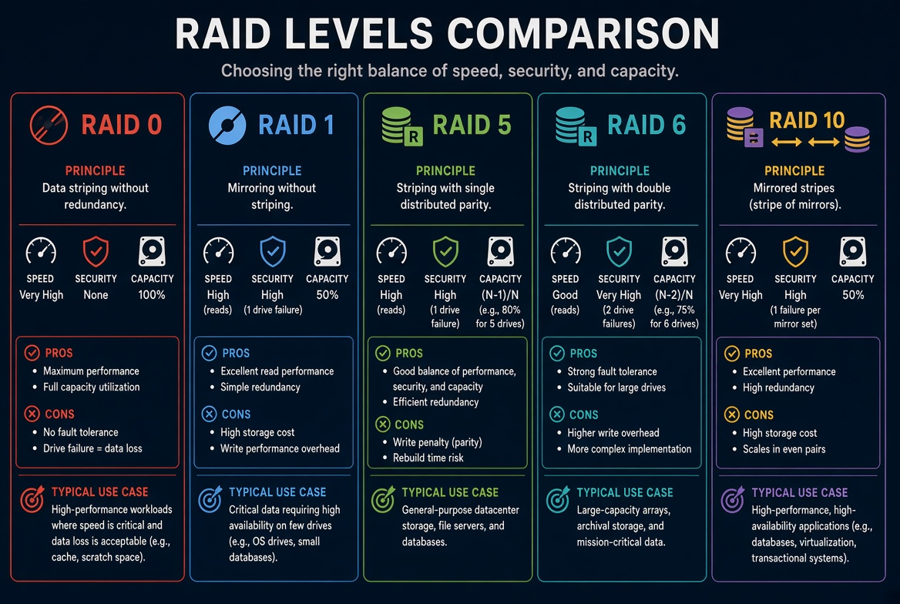

---

# RAID — Fiche comparative complète

## Vue d’ensemble

| Critère                      | RAID 0           | RAID 1         | RAID 5                 | RAID 10                      | RAID 6                         |
| ---------------------------- | ---------------- | -------------- | ---------------------- | ---------------------------- | ------------------------------ |
| **Principe**                 | Striping         | Mirroring      | Striping + parité      | Mirror + Stripe              | Striping + double parité       |
| **Disques mini**             | 2                | 2              | 3                      | 4                            | 4                              |
| **Tolérance de panne**       | 0 disque         | 1 disque       | 1 disque               | Bonne (selon disques perdus) | 2 disques                      |
| **Capacité utile**           | 100 %            | 50 %           | (n - 1)                | 50 %                         | (n - 2)                        |
| **Perf. lecture**            | Excellente       | Bonne          | Bonne                  | Excellente                   | Bonne                          |
| **Perf. écriture**           | Excellente       | Moyenne        | Moyenne                | Très bonne                   | Moyenne / plus lourde          |
| **Complexité**               | Faible           | Faible         | Moyenne                | Moyenne                      | Moyenne                        |
| **Coût relatif**             | Faible           | Moyen          | Moyen                  | Élevé                        | Moyen                          |
| **Niveau de risque rebuild** | N/A              | Faible         | Moyen à élevé          | Faible à moyen               | Moyen                          |
| **Usage pro typique**        | Rare en critique | Boot / système | Fichiers / généraliste | DB / VM / critique           | Gros volumes / stockage massif |

## RAID 0

### Avantages
- Très haute performance
- Capacité 100 % exploitée
- Simple à comprendre et à configurer

### Inconvénients
- Aucune redondance
- La perte d’un disque = perte totale du volume
- Inadapté aux données critiques

### En datacenter
Presque jamais utilisé seul sur des volumes importants.
On le retrouve plutôt :
- en cache
- en lab
- sur des données recréables
- dans certains besoins de perf pure non critiques

**Verdict pro :** performance pure, sécurité nulle.

---

## RAID 1

### Avantages
- Très simple
- Bonne disponibilité
- Rebuild relativement confortable
- Excellent pour les volumes système

### Inconvénients
- 50 % de capacité perdue
- Performance d’écriture moyenne
- Coût de capacité élevé à grande échelle

### En datacenter
Très courant pour :
- disques de boot
- OS
- petits volumes critiques
- serveurs où la simplicité prime

Via iDRAC / iLO, le diagnostic est clair :
Optimal / Degraded / Rebuilding.

**Verdict pro :** simple, fiable, parfait pour le système.

---

## RAID 5

### Avantages
- Bon compromis capacité / sécurité
- Meilleure efficacité de stockage que RAID 1 ou 10
- Lecture correcte
- Tolère 1 panne disque

### Inconvénients
- Écriture plus lourde (calcul de parité)
- Rebuild potentiellement long
- Risque accru pendant le rebuild
- Moins idéal sur très gros disques modernes

### En datacenter
Encore très présent sur :
- file servers
- volumes de données généraux
- infrastructures classiques

Mais de plus en plus challengé par le RAID 10 dès que la charge en écriture ou le niveau de criticité monte.

**Verdict pro :** bon polyvalent, attention au rebuild.

---
## RAID 6

### Avantages

- Tolère la perte de **2 disques**
- Meilleure sécurité que le RAID 5 pendant le rebuild
- Bon pour les gros volumes de données
- Meilleure efficacité de capacité que le RAID 10

### Inconvénients

- Écriture plus lourde (double calcul de parité)
- Rebuild plus calculatoire
- Moins performant que le RAID 10 en écriture intensive

### En datacenter

Très utilisé pour :

- file servers
- stockage massif
- baies avec de nombreux disques de grande capacité

Via iDRAC / iLO / contrôleur RAID, le suivi reste classique : Optimal / Degraded / Rebuilding / Failed.

**Verdict pro :** excellent pour la résilience sur gros volumes, moins idéal pour les charges d’écriture très intensives.

---
## RAID 10

### Avantages
- Excellente performance globale
- Très bonne résilience
- Rebuild plus confortable que RAID 5
- Excellent comportement en charge d’écriture

### Inconvénients
- 50 % de capacité utile seulement
- Plus cher
- Demande au minimum 4 disques

### En datacenter
Souvent le choix privilégié pour :
- bases de données
- virtualisation
- applications critiques
- environnements où la perf et la dispo sont prioritaires

C’est le RAID que beaucoup de profils infra préfèrent quand le budget le permet.

**Verdict pro :** le plus solide pour la production critique.

---

## Lecture terrain pour un technicien datacenter

### Quand un disque casse, le raisonnement reste proche
1. Identifier l’alerte (iDRAC / iLO / contrôleur)
2. Repérer le disque (slot, LED, service tag)
3. Vérifier l’état du virtual disk
4. Confirmer le type de RAID
5. Remplacer le disque (hot-swap si possible)
6. Suivre le rebuild
7. Valider le retour à Optimal
8. Documenter

### Ce qui change selon le RAID
- **RAID 0** : volume mort si un disque tombe
- **RAID 1** : service souvent maintenu, rebuild simple
- **RAID 5** : service maintenu, mais rebuild plus sensible
- **RAID 10** : service maintenu, rebuild généralement plus confortable

---

## Comment choisir en milieu pro

| Besoin principal | RAID recommandé |
|------------------|-----------------|
| Vitesse pure, données non critiques | RAID 0 |
| Simplicité + boot/OS | RAID 1 |
| Capacité correcte + budget maîtrisé | RAID 5 |
| Performance + criticité | RAID 10 |

---

## Phrase de synthèse

- **RAID 0** = vitesse, zéro filet
- **RAID 1** = miroir simple et fiable
- **RAID 5** = compromis intelligent, mais rebuild à surveiller
- **RAID 10** = le plus confortable en production exigeante

---

## Point non négociable

Quel que soit le RAID :
**ce n’est pas une sauvegarde.**

Le RAID protège contre la panne disque.
Il ne remplace ni backup, ni snapshot, ni réplication.

---
