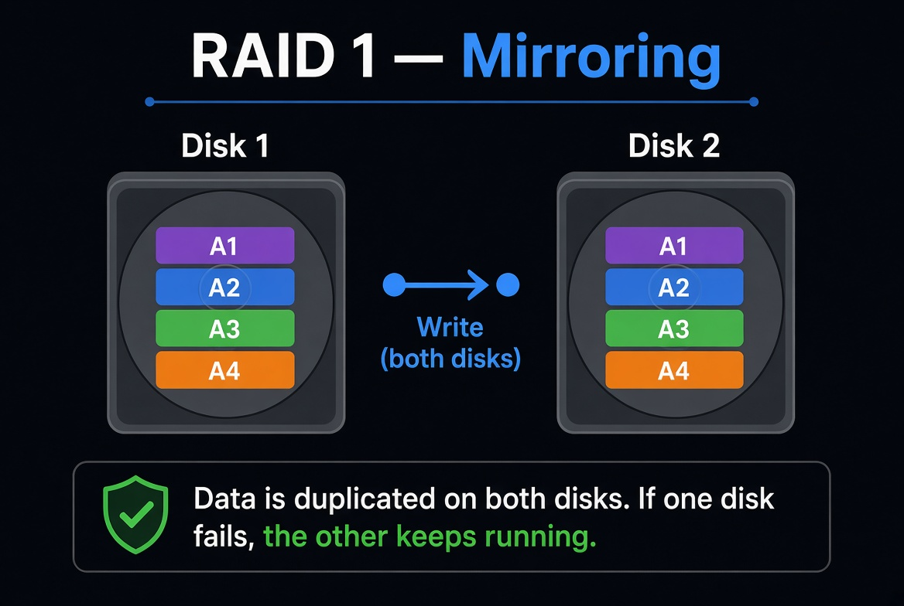
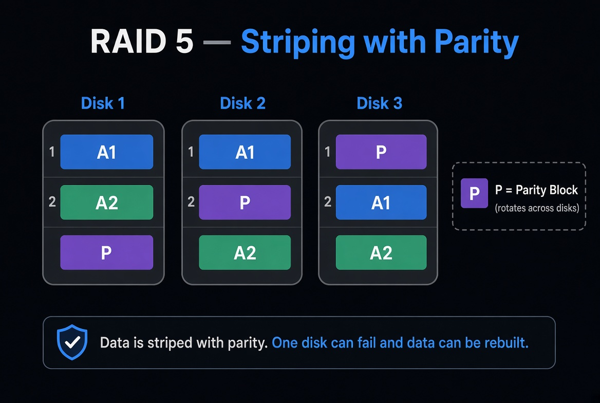
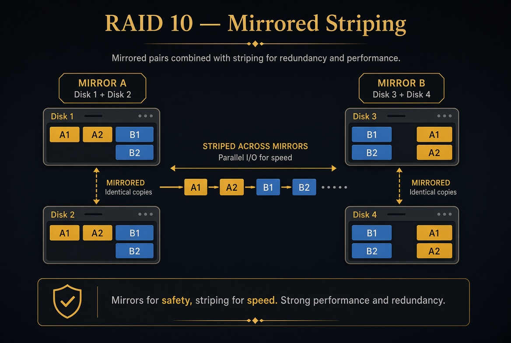
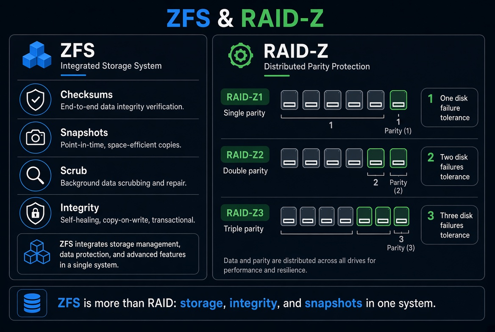
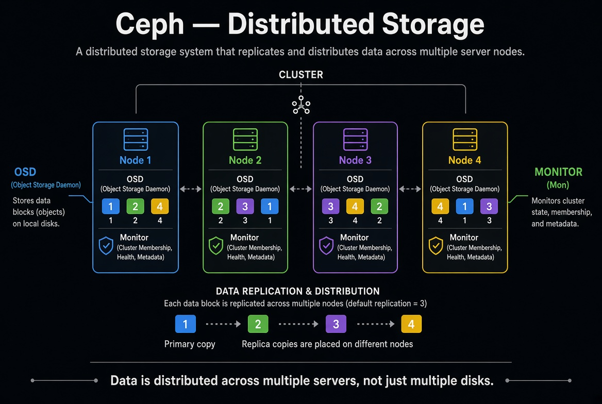

# RAID

Comprendre le RAID, du plus simple au plus avancé — niveaux classiques, ZFS, RAID-Z et stockage distribué.

---

## Introduction

Lors d’échanges techniques récents, le sujet du **RAID** est revenu comme un point fondamental en environnement datacenter.

Cette documentation reprend les niveaux essentiels, leurs cas d’usage, et la différence entre disponibilité (RAID) et récupération (sauvegarde).

---

## Contenu

1. [Le RAID en gros](1.%20Le%20RAID%20en%20gros..md)
2. [RAID 0 — En profondeur](1.%20RAID%200%20%E2%80%94%20En%20profondeur.md)
3. [RAID 1 — En profondeur](2.%20RAID%201%20%E2%80%94%20En%20profondeur.md)
4. [RAID 5 — En profondeur](3.%20RAID%205%20%E2%80%94%20En%20profondeur.md)
5. [RAID 6 — En profondeur](4.%20RAID%206%20%E2%80%94%20En%20profondeur.md)
6. [RAID 10 — En profondeur](5.%20RAID%2010%20%E2%80%94%20En%20profondeur.md)
7. [Fiche comparative complète](6.%20RAID%20%E2%80%94%20Fiche%20comparative%20compl%C3%A8te.md)
8. [Le RAID ne remplace pas une sauvegarde](7.%20Le%20RAID%20ne%20remplace%20pas%20une%20sauvegarde.md)
9. [ZFS, RAID-Z et stockage avancé](8.%20ZFS%2C%20RAID-Z%20et%20stockage%20avanc%C3%A9.md)

---

## Visuels

---

## Points clés

- RAID 0 = performance, aucune redondance
- RAID 1 = miroir simple et fiable
- RAID 5 = compromis capacité / sécurité
- RAID 6 = double parité, tolère 2 disques
- RAID 10 = performance + résilience
- RAID ≠ sauvegarde
- ZFS / RAID-Z = stockage intelligent
- Ceph = stockage distribué multi-serveurs
